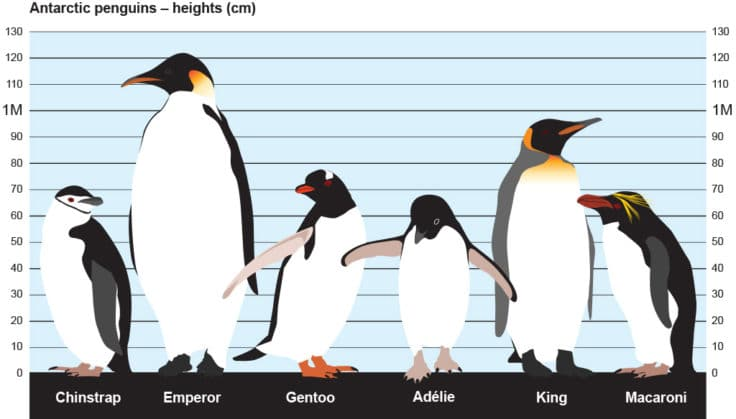

### Setup

```{r libraries, message = FALSE}
library(tidyverse)
library(tidymodels)
library(dplyr)
library(knitr)
library(palmerpenguins)
library(GGally)
library(factoextra)
library(psych)
library(patchwork)
library(factoextra)
library(cluster)
library(mclust)
library(kernlab)
```

### Introduction

```{r original-dataset, message = FALSE}
penguins_raw <- penguins_raw
names(penguins_raw)
```

Data Introduction: The data set that we aim to analyze contains data on 344 penguins. This data set contains data on 3 species of penguins (Adelie, Chinstrap, and Gentoo) from 3 islands in the Palmer Archipelago (Torgerson, Biscoe, and Dream). There are 17 variables in the dataset, and they consist of the following:

-   **studyName:** Sampling expedition from which data were collected, generated, etc.

-   **Sample Number:** an integer denoting the continuous numbering sequence for each sample

-   **Species:** a character string denoting the penguin species (Adelie, Chinstrap, Gentoo)

-   **Region:** a character string denoting the region of Palmer LTER sampling grid

-   **Island:** a character string denoting the island near Palmer Station where samples were collected

-   **Stage:** a character string denoting reproductive stage at sampling

-   **Individual ID:** a character string denoting the unique ID for each individual in data set

-   **Clutch Completion:** a character string denoting if the study nest observed with a full clutch, i.e., 2 eggs

-   **Date Egg:** a date denoting the date study nest observed with 1 egg (sampled)

-   **Culmen Length (mm):** a number denoting the length of the dorsal ridge of a bird's bill (millimeters)

-   **Culmen Depth (mm):** a number denoting the depth of the dorsal ridge of a bird's bill (millimeters)

-   **Flipper Length (mm):** an integer denoting the length penguin flipper (millimeters)

-   **Body Mass (g):** an integer denoting the penguin body mass (grams)

-   **Sex:** a character string denoting the sex of an animal

-   **Delta 15 N:** a number denoting the measure of the ratio of stable isotopes 15N:14N

-   **Delta 13 C:** a number denoting the measure of the ratio of stable isotopes 13C:12C

-   **Comments:** a character string with text providing additional relevant information for data



Motivation: We decided to use this data set for our analysis because we were interested to see if there was any variation in some of the key metrics between penguins of different species. To gain a better understanding of these key metrics, we will be using unsupervised learning techniques of Principal Component Analysis (PCA), Factor Analysis, and Cluster Analysis to get a better understanding of how the metrics are related and can be useful in predicting the species of a penguin on these islands. The metrics we will be using are the numeric variables of `Culmen Length (mm)`, `Culmen Depth (mm)`, `Flipper Length (mm)`, and `Body Mass (g)`. We have also kept `Species`, `Island`, and `Sex`. While we will be focusing on analyzing the numeric variables to get a better understanding of how they relate to the penguins' species, we may be interested in the future in conducting a similar analysis to get better understanding of how these numeric variables relate to a penguins' sex or island. Therefore, we will keep the `sex` and `island` variables. We have removed `Region`, `studyName`, `Sample Number`, `Stage`, `Individual ID`, `Clutch Completion`, `Data Egg`, `Delta 15 N`, `Delta 13 C`, and `Comments` as we believe that they are not relevant for our analysis. We will now go ahead and clean the data set to get it to the version that we want use for our analysis.

```{r removing-variables}
penguins_mod <- penguins_raw |>
  select(-studyName, -`Sample Number`, -Region, -`Individual ID`, -Stage, 
         -`Clutch Completion`, -`Date Egg`, -`Delta 15 N (o/oo)`, 
         -`Delta 13 C (o/oo)`, -Comments)
```

```{r data-cleaning, results = 'hide'}
penguins2 <- penguins_mod[rowSums(is.na(penguins)) < 2, ]
penguins2 <- penguins2 |>
  mutate(
    Species = case_when(
      Species == "Adelie Penguin (Pygoscelis adeliae)" ~ "Adelie",
      Species == "Gentoo penguin (Pygoscelis papua)" ~ "Gentoo",
      Species == "Chinstrap penguin (Pygoscelis antarctica)" ~ "Chinstrap"
    )
  )
duplicated(penguins2)
```

Here we did some initial data cleaning by removing rows that had 2 or more NA values, which removed all the NA values in our numeric variable columns. We also shortened the names of the species to make it easier when writing our report. We then checked for duplicates in our data set and found none to remove. Now, we will check for extreme outliers to remove in our data set:

```{r outliers1, echo = FALSE}
p1 <- ggplot(penguins2,aes(x=Species, y=`Culmen Length (mm)`)) + 
  geom_boxplot() 
p2 <- ggplot(penguins2,aes(x=Species, y=`Culmen Depth (mm)`)) + 
  geom_boxplot() 
p1 + p2
```

```{r outliers2, echo = FALSE}
p3 <- ggplot(penguins2,aes(x=Species, y=`Flipper Length (mm)`)) + 
  geom_boxplot() 
p4 <- ggplot(penguins2,aes(x=Species, y=`Body Mass (g)`)) + 
  geom_boxplot() 
p3+p4
```

Through viewing these boxplots of our numeric variables and how they relate to the species of the penguins, we can tell that there are no extreme outliers, which means that we can use this data set for our unsupervised learning analysis:

```{r final dataset, echo = FALSE}
knitr::kable(head(penguins2))
```

### PCA

Our first unsupervised learning technique to learn more about our data set will be the PCA. To explore the principal components of our data set to explain the variability, we have to isolate the numeric variables in the data set, which are `Culmen Length (mm)`, `Culmen Depth (mm)`, `Flipper Length (mm)`, and `Body Mass (g)`. The reason we can only use numeric variables is because the PCA relies on linear algebra calculations to find a linear combination that explains majority of the total variance, which can only be used with numeric data.

```{r pca setup, echo = FALSE}
pca_penguins2 <- penguins2[,3:6]
knitr::kable(head(pca_penguins2))
```

Let's visualize how correlated these variables are by creating a correlation plot:

```{r correlation plot, echo = FALSE}
ggcorr(penguins2[,3:6], label = TRUE, label_size = 3, hjust = 0.50, size =2)
```

From the correlation matrix, we can see that `Body Mass (g)` is very positively correlated with `Flipper Length (mm)`. Also `Culmen Length (mm)` has a somewhat strong correlation with `Flipper Length (mm)`, while `Culmen Depth (mm)` has a negative correlation with all of the variables and does not have a strong correlation with any of the variables.

```{r prcomp}
pca = prcomp(pca_penguins2, scale = TRUE)
summary(pca)
```

Running the PCA calculations out using the prcomp tool, we see that the first two principal components are responsible for about 88% percent of the data. Let's create a screeplot to visualize this:

```{r scree plot, echo = FALSE}
fviz_eig(pca, addlabels = TRUE,
         ylim = c(0,80))
```

Now let's apply the Kaiser rule to select the number of components thar we will use in the PCA:

```{r kaiser rule, echo = FALSE}
fviz_eig(pca, 
         addlabels = TRUE, 
         ylim = c(0,4),
         choice="eigenvalue",
         main="Scree Plot with Kaiser Rule") +
         geom_hline(yintercept=1, 
         linetype="dashed", 
         color = "red")
```

Only our first principal component has an eigenvalue greater than one, so our analysis will focus on the first principal component to start, which explains about 69% of the variability and is the maximum variance direction in the data. However, we may still use the second principal component if necessary. Now let's look at what variables contribute the most to our first principal component:

```{r component one, echo = FALSE}
fviz_contrib(pca, choice = "var", axes = 1)
```

On average, each variable is expected to contributed 25% to the first principal component. However, only two of those variables `Flipper Length (mm)` and `Body Mass (g)` contribute over 25% to the first principal component. We should note that a reason that this could occur is that `Flipper Length (mm)` and `Body Mass (g)` are highly correlated. Let's visualize this correlated relationship with respect to `Species`:

```{r ggplot1, message = FALSE, echo = FALSE}
penguins2 %>% 
  ggplot(aes(x = `Flipper Length (mm)`, y = `Body Mass (g)`, color = Species)) +
  geom_point() +
  labs(y = "Body Mass (Grams)",
       x = "Flipper Length (mm)",
       title = "Relationship between Flipper Length and Body Mass",
       subtitle = "Seperated by Species",
       color = "Species") +
  geom_smooth(method = "lm")
```

From this chart, we can see the differentiation of the Gentoo species from the Adelie and Chinstrap species of penguins, as the Gentoo species tends to have a greater body mass and flipper length. However, Adelie and Chinstrap are not differentiable based on their flipper length and body mass relationship. Therefore, the first principal component is an overall measure for the size of the penguins which differentiates the Gentoos. Another thing to note is that `Body Mass (g)` and `Flipper Length (mm)` display a strong positive correlation for each of the species as predicted in the correlation plot. Let's circle back to the second principal component, so that we can find a way to differentiate the Adelie and Chinstrap species as they are similar sizes:

```{r component 2, echo = FALSE}
fviz_contrib(pca, choice = "var", axes = 2)
```

In the second principal component, the two other variables contribute more than expected. Let's visualize the relationship of `Culmen Length (mm)` and `Culmen Depth (mm)` with respect to species:

```{r ggplot2, message = FALSE, echo = FALSE}
penguins2 %>% 
  ggplot(aes(x = `Culmen Depth (mm)`, y = `Culmen Length (mm)`, color = Species)) +
  geom_point() +
  labs(x = "Culmen Depth (mm)",
       y = "Culmen Length (mm)",
       title = "Relationship between Culmen Length and Depth",
       subtitle = "Seperated by Species",
       color = "Species") +
  geom_smooth(method = "lm")
```

The second principal component is explained primarily by `Culmen Length (mm)` and `Culmen Depth (mm)`. From looking at the scatter plot above, we can determine that Chinstrap penguins have similar culmen depths as Adelie penguins, but much larger culmen lengths. Also, despite being smaller penguins in size, the Chinstrap and Adelie penguins have larger culmen depths than Gentoo penguins. Gentoo penguins; however, have a much larger culmen length than Adelie penguins. Also, it is interesting to note that `Culmen Depth (mm)` and `Culmen Length (mm)` were not strongly correlated based on our correlation matrix and were also negatively correlated. However, when the relationship of these variables are separated by species, there is at least a somewhat strong positive correlation.

### Factor Analysis

After determining the meaning of our first two principal components and using the PCA to attempt to explain the total variance, we will move on to completing a factor analysis in order to better explain the variance and covariance of the observed variables in our data set by a set of fewer latent variables. Let's test if our factor analysis will run:

```{r det}
det(cor(pca_penguins2))
```

Our determinant is positive, so that means our factor analysis will most likely run.

We will be using the principal axis factor analysis and maximum likelihood factor analysis methods. We will only be using a total of two factors based on the reasoning from the PCA above. We will also be using the varimax rotational method which will minimize the number of variables that have high loadings on each factor and simplify the interpretation of each factor. We will use the method that has the highest cumulative variance on the second factor.

```{r tests}
pa <- fa(r = pca_penguins2,
         nfactors =2,
         rotate = "varimax",
         fa = "pa",
         resdiuals = TRUE)
ml <- fa(r = pca_penguins2,
         nfactors =2,
         rotate = "varimax",
         fa = "ml",
         resdiuals = TRUE)
```

The PA and ML methods both produce a cumulative variance of 0.73, so either method will work in this case. We will use the ML method going ahead. So let's view and interpret the results:

```{r ml}
ml
```

```{r fa diagram, echo = FALSE}
fa.diagram(ml, main="Factor Analysis Charted")
```

```{r barplots, echo = FALSE}
barplot(ml$loadings[,1], las=2, main = "Factor Loading 1",col="turquoise", ylim = c(-1, 1), cex.names = 0.35, border = NA)
barplot(ml$loadings[,2], las=2, main = "Factor Loading 2", col="turquoise", ylim = c(-1, 1), cex.names = 0.35, border = NA)
```

From these tables and charts, we can determine that the first factor (MR1) is related to `Flipper Length (mm)`, `Body Mass (g)`, and `Culmen Length (mm)`. However, `Culmen Length (mm)` is a feature that is poorly explained by factor analysis because less 50% of its variance is explain by the two given factor loadings. `Flipper Length (mm)` is the best explained variable by factor analysis as over 99% of its variance is explained by the two factor loadings. Therefore, the first factor loading represents the size of the penguins as it did in the PCA and it causes the flipper lengths and masses of the penguins. The second loading factor is most related to `Culmen Depth (mm)` as `Culmen Depth (mm)` has the highest MR2 value in absolute value. The second factor loading once again represents the shape of the beak, but is not as well explained as the second principal component from the PCA as `Culmen Length (mm)` is not well explained by the second factor loading. The second factor loading is also somewhat related to `Flipper Length (mm)` and `Body Mass (g)`, which also have the highest complexity. This means that these two variables do most of the explanation of the variance and covariance in the data set. According to our factor analysis, `Culmen Length (mm)` does not explain a large amount of the variance in the data set and should be considered to be taken out of models trying to predict the species of a given penguin based on the factor analysis.

Similar to the PCA, we were able reduce our data into two-dimensions with the size of the penguin and the shape of the beak. It is interesting to note that the first loading factor did a much better job at explaining the variances and covariances of the variables than the second loading factor. This may have occurred because `Culmen Depth (mm)` is not that strongly correlated with the other numeric variables and `Culmen Depth (mm)` is the main variable in the second loading factor.

Also, our PCA and factor analysis may have produced slightly different results because all of our variables are not in the same units. The reason for this is because it is impossible to convert grams to millimeters, so the `Body Mass (g)` variable has different units than the rest of the numeric variables.

Let's move onto our final unsupervised learning method to further explore our data before we make final conclusions.

### Cluster Analysis

Initial guess for the number of clusters: 3 (we chose 3 as it signifies the number of species of penguins). However, we believe the clusters are the species that each penguin is, as there is a higher variation between species of penguin versus the island that the penguin resides on. The islands could all have an even distribution of species of penguins, so it makes more sense that species is the cluster we should be focusing on.

```{r guess-clusters, echo = FALSE}
k = 3
fit = kmeans(scale(pca_penguins2), centers=k, nstart=1000)
groups = fit$cluster
barplot(table(groups), col="turquoise", border = NA, main ="Number of observations in each cluster")
```

This chart explains how many observations are in each cluster. Cluster 1 has approximately 120 observations, Cluster 2 has more than 120 observations, and Cluster 3 has approximately 80 observations.

Now to interpret the centers:

```{r interpretation-of-centers, echo = FALSE}

centers=fit$centers

barplot(centers[1,], las=2, col="turquoise",cex.names = 0.35, border = NA,
        main= "Cluster 1 Centers")
barplot(centers[2,], las=2, col="turquoise",cex.names = 0.35, border = NA,
        main = "Cluster 2 Centers")
barplot(centers[3,], las=2, col="turquoise",cex.names = 0.35, border = NA,
        main = "Cluster 3 Centers")


```

One cluster seems to have the characteristics of having a longer `Culmen depth (mm)`, as seen by the analysis of the centers of our data.

Another cluster seems to have the characteristics of having a much lower `Culmen length (mm)`.

The final cluster seems to have the characteristics of having a longer `Flipper Length (mm)` and `Body Mass (g)`.

Based on this, we can see some of the major differences between each cluster. Specifically, we see these cluster-specific differences in characteristics such as `Culmen length/depth (mm)`, `Body Mass (g)`, and `Flipper Length (mm)`.

Now, let us confirm the most optimal amount of clusters, per the silhouette method.

```{r optimal-clusters, echo = FALSE}
fviz_nbclust(scale(pca_penguins2), kmeans, method = 'silhouette', k.max = 20, 
             nstart = 1000) 

```

```{r kernel-k-means}
fit.ker <- kkmeans(as.matrix(pca_penguins2), centers=3, kernel="rbfdot") 

centers(fit.ker)
size(fit.ker)
withinss(fit.ker)

object.ker = list(data = pca_penguins2, cluster = fit.ker@.Data)

fviz_cluster(object.ker, geom = c("point"), ellipse=F,pointsize=1) +
  theme_minimal()
```

As seen by the above Kernel k-means analysis, we are using 2 of the principal components to visualize the data. Again, the first 2 principal components make up 88% of the variability. In the above plot, we see 2 very clear groups of points. In the group on the left, it is mainly dominated by clusters 1 and 3, but the one on the right is dominated mainly by points from cluster 2. We found this very interesting as we had expected to see 3 clear clusters, one for each species. However, we only see two, and in one of the groups, points from two clusters are mixed quite evenly. However, k-means are mainly used for highly non-linear data, so maybe another approach to identify clusters may be beneficial to use.

Per our above analysis on the optimal number of clusters, as well as the plot showing the relationship between `Flipper Length (mm)` and `Body Mass (g)`, we will now use 2 clusters as the "guess" when analyzing our centers.

```{r}

y = 2

fit = kmeans(scale(pca_penguins2), centers=y, nstart=1000)
groups = fit$cluster
barplot(table(groups), col="turquoise", main ="Number of observations in each cluster", border = NA)
```

We see that there is some slight unbalance in the number of observations in each of the clusters. Cluster 2 (likely the cluster excluding the Gentoo species) has over 200 observations, whereas Cluster 1 (Gentoo species cluster) has approximately 125 observations.

Interpret the centers:

```{r}

centers=fit$centers

barplot(centers[1,], las=2, col="turquoise",cex.names = 0.35, border = NA,
        main = "Cluster 1 Centers")
barplot(centers[2,], las=2, col="turquoise", cex.names = 0.35, border = NA,
        main = "Cluster 2 Centers")

```

Now, the differences between both clusters are much more distinct. `Culmen Depth (mm)` is notably higher in the first cluster, whereas the other 3 key continuous variables (`Culmen Length (mm)`, `Flipper Length (mm)`, and `Body Mass (g)`), are noticeably higher in the second one.

To conclude, we originally thought that there would be three clusters, as species was a clear defining categorical variable that can be used to distinguish between penguins. However, after looking at the plots of the principal components, as well as the optimal cluster analysis, we can conclude that there are 2 clusters in our data.

### Conclusion

It is essential to outline some of the main distinguishing factors between the 3 species of penguins that we are analyzing. Upon looking at the plot in the PCA, which displays the relationship between `Flipper Length (mm)` and `Body Mass (g)` with respect to species, we can see that the Gentoo penguins are in its own group in the top right, while the Adelie and Chinstrap penguins are clumped together, as they are similar in size. In fact, Gentoo penguins are the third largest species of penguins, while the Chinstrap and Adelie penguins are 5th and 6th largest, respectively. With regards to our cluster analysis, we originally guessed that there would be 3 clusters, but upon analyzing the optimal number of clusters, and visualizing the data through the first two principal components allowed us to conclude that there were in fact 2 clusters, albeit of different sizes.

Adelie and Chinstrap penguins are differentiated by the shape of their culmens. Chinstraps have similiar culmen depths as Adelies, but longer culmen lengths. However, Chinstraps have similiar culmen lengths as Gentoos, but longer culmen depths. According to the factor analysis, the `Culmen Length (mm)` variable was not useful, but that was proven false in PCA. Therefore, we can conclude that all four of the numeric variables that we explored are useful in predicting the species of a penguin. Our unsupervised learning techniques proved that we can reduced these four variables into the two-dimensions of penguin size and culmen shape to complete the analysis.

Further directions would include creating a model to predict a penguins species using these numeric variables, as well as exploring the `Island` and `Sex` variables of our data set in relation to the numeric variables.

### Sources

1)  [penguins_raw data set](https://allisonhorst.github.io/palmerpenguins/)
2)  [Kaiser Rule for PCA](https://statisticsglobe.com/scree-plot-pca)
3)  [PA and ML Methods for Factor Analysis](https://www.youtube.com/watch?v=kbJMz0KzMnI)
4)  Previous Computer Labs
